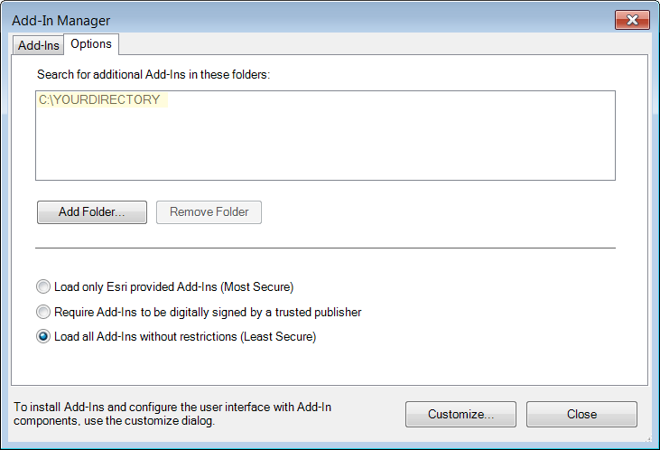
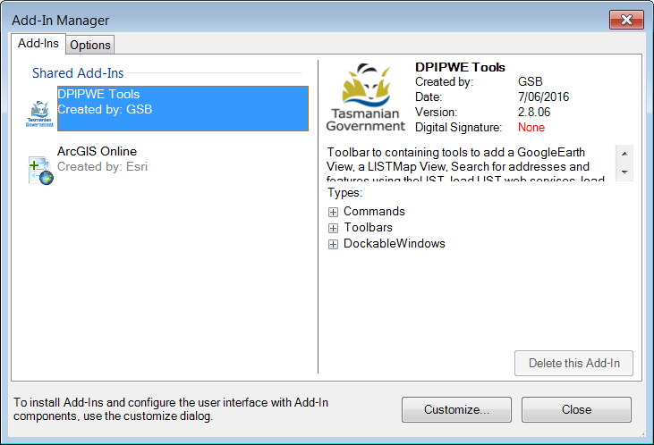

DPIPWE\_Tools\_Addin: release notes: v2.8.06
============================================

------------------------------------------------------

Features
--------

This ESRI Aaddin toolbar provides access to a variety of web based services: Google Earth, theLIST and ESRI portal. These services are for the Australian state of Tasmania. This Addin is provided by the [Land Tasmania](<http://dpipwe.tas.gov.au/land-tasmania>).

The [LIST](<http://dpipwe.tas.gov.au/land-tasmania/the-list>)  (Land Information System Tasmania) is a contemporary online service that provides access to integrated land and property information service. [LISTMap](<http://dpipwe.tas.gov.au/land-tasmania/the-list/listmap>) allows users to view and create maps from hundreds of authoritative spatial datasets, and find out more about the information shown on those maps.

Spatial datasets include natural resources, roads, community facilities, property boundaries (cadastre), aerial imagery and survey information.

LISTmap is publicly available through your computer's web browser or via your mobile device.

The DPIPWE\_Tools\_Addin has single click buttons for loading either the Tasmanian colour topographic base-map, or the statewide ortho-photo mosaic from LISTMap into ArcMap. The user can also link to other LIST web services via ArMap’s catalog. A view of LISTMap with the same extent as ArcMap extent can be loaded into your browser. A version of theLIST search service is provided that finds and highlights feature.

Google Earth can be invoked with a view that matches the current ArcMap frame extent.

Connect to ArcGIS Online public data with a single button click.

Compatibility
-------------

**ArcMap.** ESRI ArcGIS **10.3** and probably ArcGIS 10.4. It is not compatible with earlier versions or with ArcGIS Pro.

**Net Framework**. It targets the .**Net 4.0** framework and so should be compatible with this or more recent versions of the .Net framework.

**GoogleEarth**. It is fully compatible with **v7.1.2.2041** of Google Earth and Google Earth Pro. Some earlier versions have been tested and work fine. However, more recent versions than v7.1.2.2041 are not fully compatible. A warning message is issued if the user has an incompatible version and a Google Earth window will not be opened.

Version v7.1.2.2041 of Google Earth and Google Earth Pro can be downloaded from [Google Support](https://support.google.com/earth/answer/168344?hl=en)

Later versions can be used, but the user must install both v7.1.2.2041 and the more recent version. The more recent version must be started manually before the GoogleView command is used.

Loading AddIn’s in ArcMap
-------------------------

Down load the latest release, unpack the \*.esriAddin file. Place this file in an accessible directory. This directory can be on a network drive and so available to everybody that has access to that drive. The \*.esriAddin file should be at the top level of the directory.

-   In ArcMap: go to the **Customize** Menu

    -   Add In Manager

    -   Options Tab

-   Add Folder. When the Add File dialog appears you can either navigate to the folder of paste in its path

-   Check *“**Load All Add-Ins**” without restrictions (least secure)* option. We publish our Addins without a digital signature.

-   Save the mxd document

> 

The tool should appear in the list of tools with the ArcMap Add-In Manager. The version and date information should match those of the release.

Next time ArcMap is started, the tool should be available: Look in the toolbars menu:

-   Customize

-   Toolbars

-   Select “DPIPWE Tools”

 The DPIPWE\_Tools\_Addin toolbar should appear.

#### Version Information

1.  The ArcMap Add-In Manager ( Customize -- &gt; Add-In Manager) should show DPIPWE\_Tools\_Addin with information about its version, creation date, author, and a description, e.g. :

    

2.  Clicking the help button shows the version number at the top of the help window. This is straight from the application and can be relied upon.

### Known limitations/issues

***ListView***: Each time ListView is invoked a new tab is open up your browser.

***GoogeView:*** Only version **v7.1.2.2041** of Google Earth and Google Earth Pro and earlier are fully compatible. A warning message is issued if the user has an incompatible version and a Google Earth window will not be opened...

Version v7.1.2.2041 of Google Earth and Google Earth Pro can be downloaded from [Google Support](https://support.google.com/earth/answer/168344?hl=en)

Later versions can be used, but the user must install both v7.1.2.2041 and the more recent version. The more recent version must be started manually before the GoogleView command is used. This applies to Google Earth standard and Pro.

***List Search*** This release has an older version of the LIST search engine. It does not accept abbreviations such as Rd for Road.

Contact
-------

Please be aware that the tools have been developed primarily for internal DPIPWE staff, and hence our ability to provide support to external users is limited. To contact the GIS Systems and Development group:

**Spatial Operations**

134 Macquarie Street

HOBART TAS 7000

Phone (03) 6165 4118

Email [mailto:gissd@dpipwe.tas.gov.au](mailto:gissd@dpipwe.tas.gov.au)

